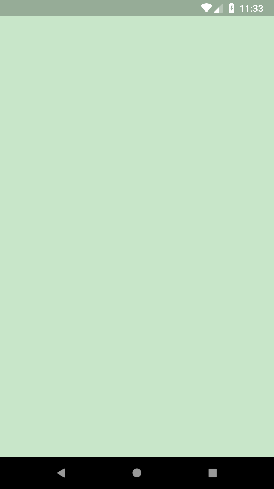
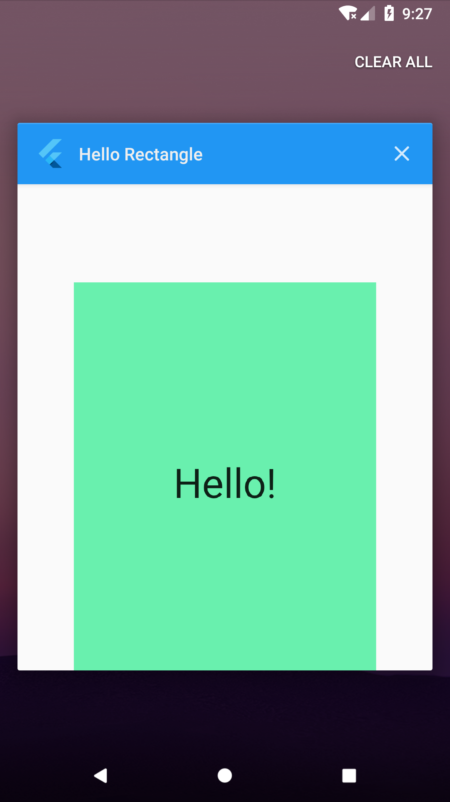

# Code a Custom Category Widget!

## Goals
 - Using the existing Flutter widgets, build a custom Category widget.
 - Customize the widget to your liking.

## Steps
 1. Fill out the TODOs in `category.dart` and `main.dart` using the specs below.
 2. Customize your Category widget if desired. Some ideas are listed below.

## Specs
 - The height of the Category widget is 100.0
 - The icon size is 60.0
 - The text size is 24.0
 - The InkWell will not animate if the onTap function is null. Use a print statement for now, as a placeholder. i.e. ```onTap: () { print('I was tapped!'); }```

## Screenshots

## Start


## Solution
