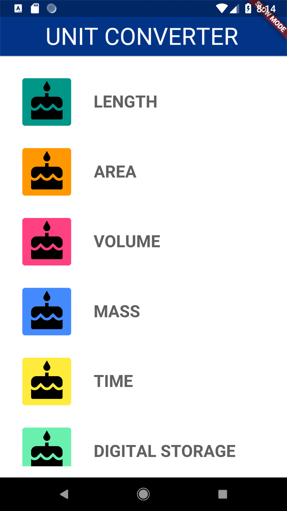
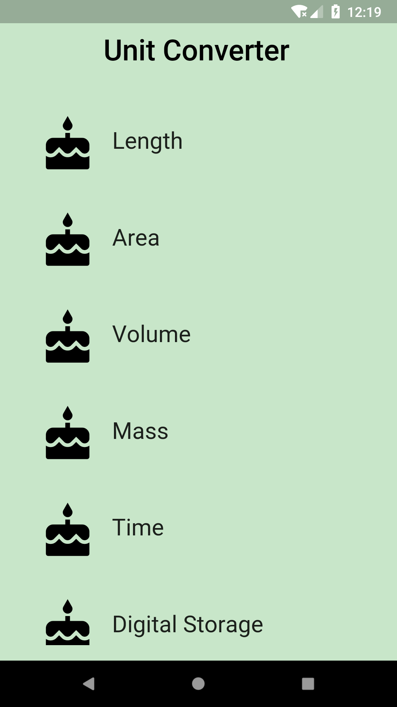

# Create the Category Route!

## Goals
 - Create the homepage (route) of the app.
 - Create a ListView for the Categories.

## Steps
 1. Fill out the TODOs in `main.dart` and `category_route.dart` using the specs below.
 2. Customize your app if desired. Some ideas are listed below.

## Specs
 - The AppBar text should say 'Unit Converter' with a font size of 30.0, and an elevation of 0.0.
 - A list of 8 Categories should be shown on the Category Route. You should be able to scroll down the list.
 - The AppBar and app body should be the same color. In our example, we use `Colors.green[100]`.

## Customizations
 - Whether to center the AppBar title
 - App's background color
 - InkWell color for each Category
 
## Screenshots

## Start

## Solution
