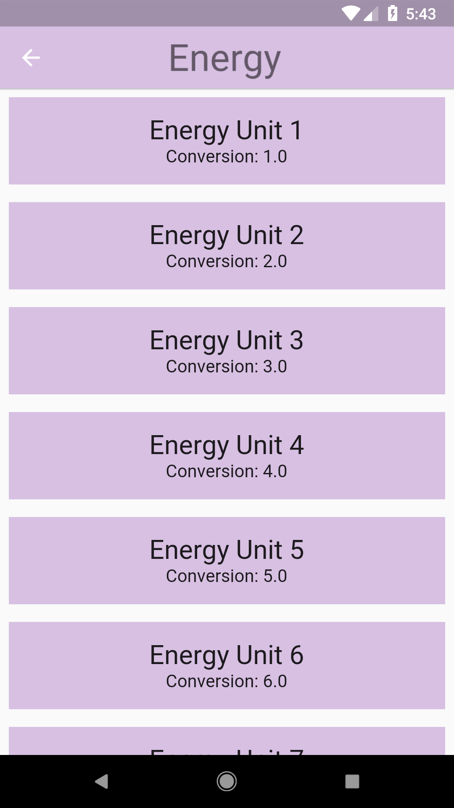
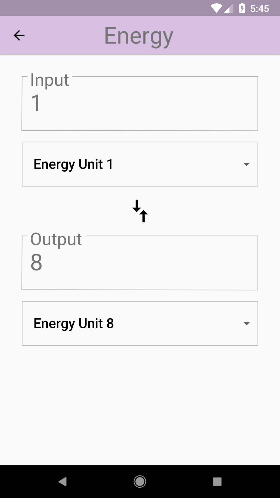

# Add User Input!

## Goals
- Add user input so that a user can convert an amount from one unit to another.

## Steps
 1. Fill out the TODOs in `converter_route.dart` using the specs below.
 2. Use the helper functions provided to perform the conversions. Remember to set the state!

## Specs
 - The 'input' group is composed of a TextField and a Dropdown for the 'From' unit. This group has a Padding of 16.0.
 - The input TextField should be styled with its label in the border (see screenshot). Hint: Use the OutlineInputBorder widget.
 - An error style with error text should show up when invalid values are entered.
 - The 'output' group is composed of an output Text with the conversion result, and a Dropdown for the 'To' unit. It likewise has an overall Padding of 16.0.
 - The output text should also be wrapped inside a border.
 - Dropdowns have a vertical 8.0 Padding.
 - Add a 'Compare Arrows' icon between the Dropdowns. This is the Material Icon named 'compare arrows'. The arrows are sized 40.0.
 - The entire user input section is wrapped in 16.0 Padding.

## Customizations
 - Style in the input/output boxes and dropdowns.

## Screenshots

### Start

### Solution

