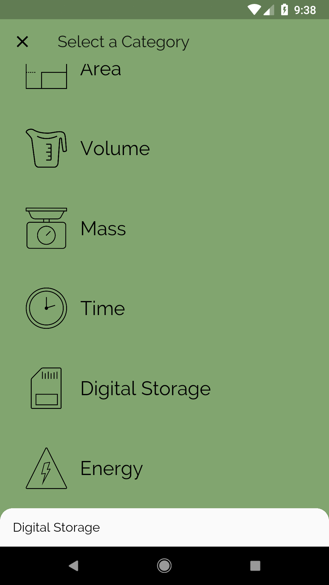

# Include Real-Time Units!

## Goals
- Incorporate real-time unit conversions, provided by an API.

## Steps
 1. Fill out the TODOs in `api.dart`, `category_route.dart` and `unit_converter.dart` using the specs below.

## Specs

## Customizations

## Screenshots

### Start

### Solution

